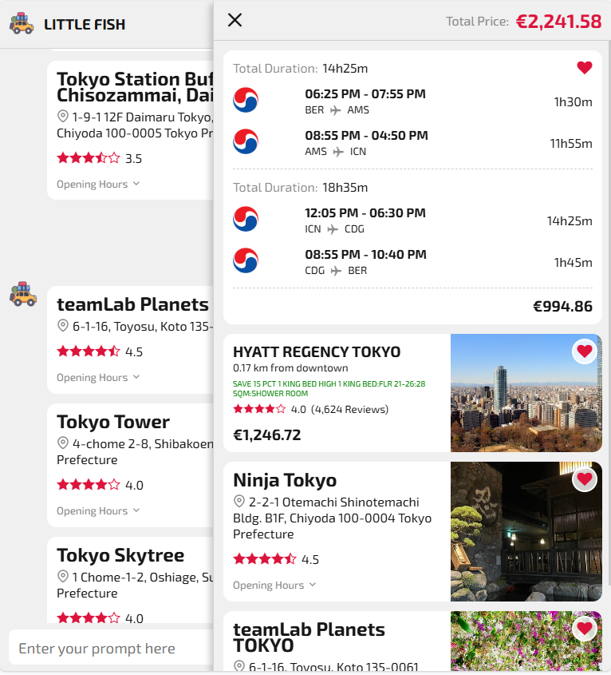

# Introduction
This project aims at developing an AI-based travel assistant the supports users by using a natural language interface. This app works like a chatbot, helping users find flights, hotels, attractions, and restaurants effortlessly.

Exhaustive experiments around the following use cases were performed:
- Can the AI Assistant get Information about Flights, Hotels, Attractions, Restaurants base on specific date?
- Can the AI Assistant get Information about Flights, Hotels, Attractions, Restaurants base on criteria of user prompt, example cheapest, fastest, highest rating?
- Can the AI Assistant get the best choice flights, hotels?
- Can the AI assistant bookmark favorite choices, create a prepared list for travel, and calculate the total price for the trip?

### System Overview


# Demo
### Online
Go to https://little-fish.dttt.io for the live demo.
Scan the QR code below for quick access.


### Local
Make sure you are under `Backend` directory and run this command with your custom message
```
python invoke.py --message "Where to eat in Berlin?"
```

# Set up & Run locally
### Backend
1. Install the dependencies
    ```
    pip install -r requirements.txt
    ```
2. Start the server
    ```
    python server_rest.py
    ```
### Frontend
1. Install the dependencies
    ```
    npm install
    ```
2. Start the web
    ```
    npm run dev
    ```
3. Open http://localhost:3000 to see the UI

# Some prompts to try
### To query information from external APIs
- "Show me flights from Berlin to Seoul from 25.02 to 28.02.2025"
- "Where to stay in Seoul from 25.02 to 28.02.2025?"
- "Show me some places to visit in Seoul"
- "Where to eat in Tokyo?"
### To analyze data from database. Always start the prompt with "Analyze"
- "Analyze top 3 fastest flights"
- "Analyze top 3 best flights"
- "Analyze top 3 cheapest hotels in Seoul"
- "Analyze top 3 best-rated places in Seoul"
- "Analyze top 3 rated restaurants in Berlin"

# Some results
## Flights


## Hotels


## Restaurants


## Attractions


## Favorite items



